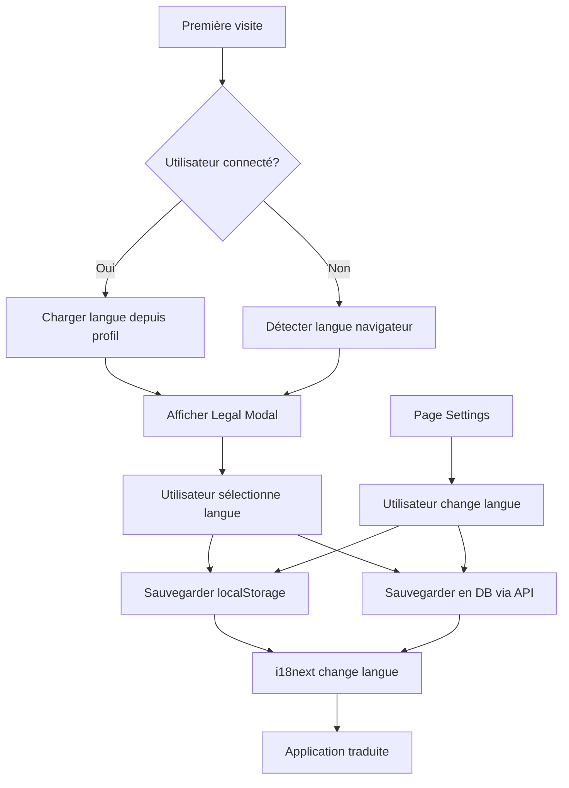

# 🌍 Système d'Internationalisation (i18n) - Reviews-Maker

## ✅ Implémentation Complète (Décembre 2025)

### 📋 Vue d'ensemble

Le système d'internationalisation complet a été implémenté avec support de **5 langues** :
- 🇺🇸 **Anglais US** (English US)
- 🇬🇧 **Anglais UK** (English UK) - partage les traductions avec US
- 🇫🇷 **Français** (France)
- 🇩🇪 **Allemand** (Deutsch)
- 🇪🇸 **Espagnol** (Español)

---

## 🎯 Fonctionnalités Implémentées

### 1. **Sélection de langue à la première connexion** ✅
- **Où** : Modal Legal Welcome (`LegalWelcomeModal.jsx`)
- **Comportement** :
  - Lors de la première visite, un encadré violet met en évidence le sélecteur de langue
  - 5 boutons avec drapeaux pour choisir la langue
  - La sélection est mise en surbrillance (bordure violette + fond violet)
  - Le choix est sauvegardé automatiquement dans le profil utilisateur

**Exemple visuel :**
```
┌────────────────────────────────────────┐
│ 🌍 Choisissez votre langue             │
│ ┌──────────┬──────────┐                │
│ │ 🇺🇸 EN US │ 🇬🇧 EN GB │                │
│ └──────────┴──────────┘                │
│ ┌──────────┬──────────┬──────────┐     │
│ │ 🇫🇷 FR    │ 🇩🇪 DE    │ 🇪🇸 ES    │     │
│ └──────────┴──────────┴──────────┘     │
└────────────────────────────────────────┘
```

---

### 2. **Détection automatique** ✅
- **Priorité 1** : Langue sauvegardée dans le profil utilisateur (champ `locale` en DB)
- **Priorité 2** : Langue stockée dans `localStorage` (`userLanguage`)
- **Priorité 3** : Langue du navigateur (via `navigator.language`)
- **Fallback** : Anglais (EN) si aucune correspondance

---

### 3. **Modification depuis les Paramètres** ✅
- **Où** : Page Settings (`SettingsPage.jsx`)
- **Section dédiée** : "Langue de l'application" avec icône 🌍
- **Grille de 5 boutons** avec drapeaux
- **Sauvegarde instantanée** :
  - Frontend : `localStorage` + `i18next`
  - Backend : API `PATCH /api/account/language`
  - Base de données : Champ `locale` dans la table `users`
- **Confirmation visuelle** : Toast vert "Préférences enregistrées"

---

### 4. **Traduction intégrale des textes** ✅

#### Fichiers de traduction créés :
```
client/src/i18n/
  ├── fr.json     (Français) ✅
  ├── en.json     (English)  ✅
  ├── de.json     (Deutsch)  ✅
  ├── es.json     (Español)  ✅
  ├── i18n.js     (Configuration) ✅
  └── legalWelcome.json (Traductions Legal Modal) ✅
```

#### Sections traduites :
- ✅ Bannière RDR (Réduction des Risques)
- ✅ Vérification de l'âge
- ✅ Consentement legal complet
- ✅ Liste des pays
- ✅ Messages communs (loading, error, success, etc.)

---

### 5. **Modularité et évolutivité** ✅

#### Architecture flexible :
```javascript
// i18n.js
export const SUPPORTED_LANGUAGES = [
    { code: 'en-US', flag: '🇺🇸', label: 'English (US)', i18nCode: 'en' },
    { code: 'en-GB', flag: '🇬🇧', label: 'English (UK)', i18nCode: 'en' },
    { code: 'fr', flag: '🇫🇷', label: 'Français', i18nCode: 'fr' },
    { code: 'de', flag: '🇩🇪', label: 'Deutsch', i18nCode: 'de' },
    { code: 'es', flag: '🇪🇸', label: 'Español', i18nCode: 'es' },
];

// Helper pour changer de langue
export const changeLanguage = async (langCode) => {
    await i18n.changeLanguage(langCode);
    localStorage.setItem('userLanguage', langCode);
    document.documentElement.lang = langCode;
};
```

#### Ajout d'une nouvelle langue :
1. Créer `client/src/i18n/[code].json` (copier `fr.json` et traduire)
2. Importer dans `i18n.js`
3. Ajouter au tableau `SUPPORTED_LANGUAGES`
4. Ajouter dans la validation backend (`validLocales`)

---

## 🔧 Points Techniques

### Frontend

#### Configuration i18next :
- **Framework** : `react-i18next` + `i18next-browser-languagedetector`
- **Détection** : localStorage → navigator → htmlTag
- **Fallback** : EN (anglais)
- **Cache** : localStorage (`i18nextLng`)
- **Suspense** : désactivé pour éviter les problèmes

#### Utilisation dans les composants :
```jsx
import { useTranslation } from 'react-i18next';

function MyComponent() {
    const { t } = useTranslation();
    
    return (
        <div>
            <h1>{t('common.loading')}</h1>
            <p>{t('ageVerification.description')}</p>
        </div>
    );
}
```

---

### Backend

#### Schéma Prisma :
```prisma
model User {
  id            String   @id @default(uuid())
  // ...
  locale        String   @default("fr")  // "fr", "en", "es", "de"
  // ...
}
```

#### Route API :
```javascript
// PATCH /api/account/language
router.patch('/language', asyncHandler(async (req, res) => {
    const { locale } = req.body;
    
    // Validation
    const validLocales = ['fr', 'en', 'de', 'es'];
    if (!validLocales.includes(locale)) {
        return res.status(400).json({ error: 'invalid_locale' });
    }
    
    // Update DB
    const updatedUser = await prisma.user.update({
        where: { id: req.user.id },
        data: { locale },
    });
    
    res.json({ success: true, locale: updatedUser.locale });
}));
```

---

## 📊 Flux de données



---

## 🎨 Interface Utilisateur

### Legal Modal (Première visite)

```
┌─────────────────────────────────────────────────────┐
│              🌍 BIENVENUE SUR TERPOLOGIE            │
│           Plateforme de reviews cannabis            │
├─────────────────────────────────────────────────────┤
│ 🌍 Choisissez votre langue / Choose your language  │
│                                                     │
│ ┌─────────────┬─────────────┐                      │
│ │  🇺🇸         │  🇬🇧         │                      │
│ │ English (US)│ English (UK)│                      │
│ └─────────────┴─────────────┘                      │
│ ┌─────────────┬─────────────┬─────────────┐        │
│ │  🇫🇷         │  🇩🇪         │  🇪🇸         │        │
│ │  Français   │  Deutsch    │  Español    │        │
│ └─────────────┴─────────────┴─────────────┘        │
│                                                     │
│ ⚠️ Avertissement RDR                                │
│ [Texte traduit selon langue sélectionnée]          │
│                                                     │
│ ☑ Je confirme avoir 18 ans ou plus                 │
│ ☑ J'accepte la charte légale                       │
│                                                     │
│          [Refuser]    [Continuer]                   │
└─────────────────────────────────────────────────────┘
```

### Settings Page

```
┌─────────────────────────────────────────────────────┐
│ ⚙️ Paramètres                                       │
│ Personnalisez votre expérience Reviews Maker       │
├─────────────────────────────────────────────────────┤
│                                                     │
│ 🎨 Thème de l'application                          │
│ [Violet Lean] [Émeraude] [Tahiti] [Sakura] [Dark]  │
│                                                     │
│ 🌍 Langue de l'application                         │
│ Choisissez votre langue préférée                   │
│                                                     │
│ ┌─────────────┬─────────────┬─────────────┐        │
│ │  🇺🇸 ✓       │  🇬🇧         │  🇫🇷         │        │
│ │ English (US)│ English (UK)│  Français   │        │
│ │ United      │ United      │  France     │        │
│ │ States      │ Kingdom     │             │        │
│ └─────────────┴─────────────┴─────────────┘        │
│ ┌─────────────┬─────────────┐                      │
│ │  🇩🇪         │  🇪🇸         │                      │
│ │  Deutsch    │  Español    │                      │
│ │ Deutschland │  España     │                      │
│ └─────────────┴─────────────┘                      │
│                                                     │
│ ⚙️ Préférences par défaut                          │
│ [...]                                               │
└─────────────────────────────────────────────────────┘
```

---

## 🚀 Utilisation

### Pour l'utilisateur

1. **Première connexion** :
   - Le modal legal s'affiche avec un encadré violet
   - Sélectionner la langue préférée parmi les 5 options
   - Valider → la langue est sauvegardée

2. **Changement ultérieur** :
   - Aller dans **Paramètres** (icône profil → Paramètres)
   - Section "Langue de l'application"
   - Cliquer sur le drapeau souhaité
   - Changement **instantané** + sauvegarde automatique

3. **Connexion depuis un autre appareil** :
   - La langue du profil est automatiquement appliquée

---

### Pour les développeurs

#### Ajouter une traduction :
```json
// client/src/i18n/fr.json
{
  "mySection": {
    "title": "Mon titre",
    "description": "Ma description"
  }
}
```

#### Utiliser dans un composant :
```jsx
import { useTranslation } from 'react-i18next';

function MyComponent() {
    const { t } = useTranslation();
    
    return <h1>{t('mySection.title')}</h1>;
}
```

#### Changer la langue programmatiquement :
```javascript
import { changeLanguage } from '../i18n/i18n';

await changeLanguage('de'); // Change to German
```

---

## 📝 Migration de données

Si des utilisateurs existent déjà en base :

```sql
-- Prisma migrate appliquera automatiquement la valeur par défaut "fr"
-- Pour mettre à jour manuellement :
UPDATE users SET locale = 'fr' WHERE locale IS NULL;
```

---

## ✅ Checklist d'implémentation

- [x] Fichiers de traduction (FR, EN, DE, ES)
- [x] Configuration i18next avec détection automatique
- [x] Champ `locale` dans le schéma Prisma
- [x] Route API `PATCH /api/account/language`
- [x] Sélecteur de langue dans Legal Modal (première visite)
- [x] Section langue dans Settings Page
- [x] Sauvegarde automatique en DB
- [x] Changement instantané sans rechargement
- [x] Persistance entre sessions
- [x] Drapeaux et labels clairs
- [x] Validation côté serveur
- [x] Fallback en cas de langue manquante
- [x] Mise à jour de l'attribut `lang` du HTML

---

## 🎓 Ressources

- **i18next** : https://www.i18next.com/
- **react-i18next** : https://react.i18next.com/
- **Drapeaux emoji** : Unicode Standard (supporté nativement)

---

## 🔮 Évolutions futures

1. **Ajout de langues** :
   - 🇮🇹 Italien
   - 🇵🇹 Portugais
   - 🇳🇱 Néerlandais
   - 🇯🇵 Japonais
   - 🇨🇳 Chinois

2. **Traductions contextuelles** :
   - Adapter les formats de date selon la locale
   - Adaptation des unités (métrique/impérial)

3. **Traduction des reviews** :
   - Option pour afficher les reviews dans la langue de l'interface
   - Traduction automatique via API

4. **Support RTL** (Right-to-Left) :
   - Pour langues arabes/hébraïques futures

---

## 📞 Support

Pour toute question ou problème lié à l'i18n :
- Consulter les logs console (`?debug=1`)
- Vérifier la valeur de `localStorage.getItem('userLanguage')`
- Vérifier le champ `locale` en base de données

---

**Documentation générée le** : 11 décembre 2025  
**Version** : 1.0.0  
**Statut** : ✅ Production Ready
