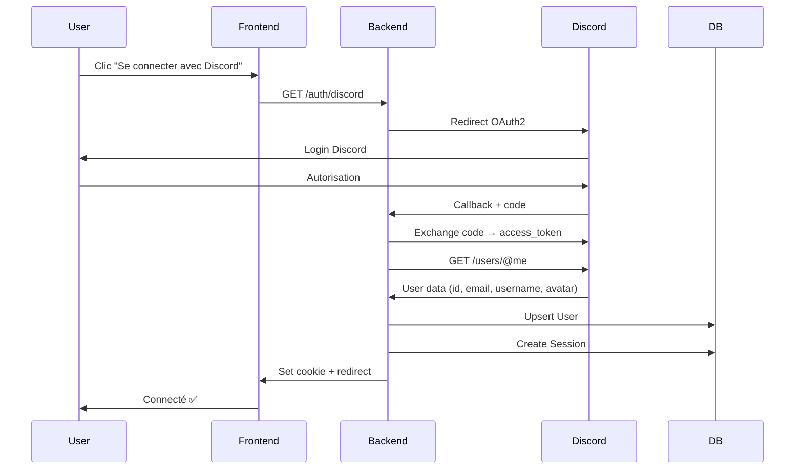

# 🚀 Reviews Maker - Refonte Autonome 2025

> **Objectif** : Rendre Reviews-Maker totalement autonome suite à la fermeture de LaFoncedalle

---

## 📊 État des lieux - Dépendances LaFoncedalle

### Intégrations actuelles détectées

#### 1. **Authentification** (`server/utils/lafoncedalle.js`)
- ✅ Connexion via API LaFoncedalle (`/discord/user/:email`)
- ✅ Lecture directe de la base LaFoncedalleBot (table `users`)
- ✅ Variables d'environnement :
  - `LAFONCEDALLE_API_URL`
  - `LAFONCEDALLE_API_KEY`
  - `LAFONCEDALLE_DB_FILE`

#### 2. **Stockage utilisateurs**
- ⚠️ Aucune table `users` propre à Reviews-Maker
- ⚠️ `ownerId` dans table `reviews` référence Discord ID via LaFoncedalle
- ⚠️ Système de tokens fichiers (`server/tokens/`) pour auth persistante

#### 3. **Données à préserver**
```
db/
├── reviews.sqlite (CRITIQUE - toutes les reviews)
│   └── Table: reviews (id, productType, name, data, imagePath, ownerId, isDraft, isPrivate, createdAt, updatedAt)
└── review_images/ (CRITIQUE - toutes les images)
```

---

## 🎯 Nouvelle Architecture Autonome

### Stack Technique Recommandée

```
Frontend (Moderne & Épuré)
├── React 18 + Vite (ou SvelteKit pour ultra-légèreté)
├── TailwindCSS + Framer Motion (animations fluides)
├── Zustand (state management simple)
└── React Query (cache & sync serveur)

Backend (Simple & Robuste)
├── Node.js + Express (ou Fastify pour performances)
├── SQLite (garder la simplicité) → PostgreSQL si scale
├── Prisma ORM (typage, migrations automatiques)
└── Discord OAuth2 direct (pas d'intermédiaire)

Services Externes
├── Discord OAuth2 (connexion rapide)
├── Resend / SendGrid (emails transactionnels)
└── Cloudflare R2 (stockage images - optionnel)
```

---

## 🗄️ Nouveau Schéma de Base de Données

### Schema Prisma (simple et propre)

```prisma
// schema.prisma
generator client {
  provider = "prisma-client-js"
}

datasource db {
  provider = "sqlite" // ou "postgresql"
  url      = env("DATABASE_URL")
}

// ━━━━━━━━━━━━━━━━━━━━━━━━━━━━━━━━━━━━━━━━━━━━━━
// UTILISATEURS
// ━━━━━━━━━━━━━━━━━━━━━━━━━━━━━━━━━━━━━━━━━━━━━━

model User {
  id        String   @id @default(cuid())
  email     String   @unique
  
  // Discord Integration
  discordId       String?  @unique
  discordUsername String?
  discordAvatar   String?
  
  // Metadata
  createdAt DateTime @default(now())
  updatedAt DateTime @updatedAt
  lastLogin DateTime?
  
  // Preferences
  defaultPrivacy Boolean  @default(false) // false = public
  theme          String   @default("violet")
  
  // Relations
  reviews  Review[]
  sessions Session[]
}

// ━━━━━━━━━━━━━━━━━━━━━━━━━━━━━━━━━━━━━━━━━━━━━━
// SESSIONS (authentification)
// ━━━━━━━━━━━━━━━━━━━━━━━━━━━━━━━━━━━━━━━━━━━━━━

model Session {
  id        String   @id @default(cuid())
  token     String   @unique
  userId    String
  expiresAt DateTime
  createdAt DateTime @default(now())
  
  user User @relation(fields: [userId], references: [id], onDelete: Cascade)
  
  @@index([token])
  @@index([userId])
}

// ━━━━━━━━━━━━━━━━━━━━━━━━━━━━━━━━━━━━━━━━━━━━━━
// REVIEWS
// ━━━━━━━━━━━━━━━━━━━━━━━━━━━━━━━━━━━━━━━━━━━━━━

model Review {
  id          String   @id @default(cuid())
  name        String
  productType String   // "Fleur", "Hash", "Concentré"
  
  // Data (JSON flexible pour ne pas casser l'existant)
  data        Json
  
  // Image
  imagePath   String?
  
  // Ownership
  userId      String
  user        User     @relation(fields: [userId], references: [id], onDelete: Cascade)
  
  // Status
  isDraft     Boolean  @default(true)
  isPrivate   Boolean  @default(false)
  
  // Metadata
  createdAt   DateTime @default(now())
  updatedAt   DateTime @updatedAt
  
  // Stats
  viewCount   Int      @default(0)
  likeCount   Int      @default(0)
  
  @@index([userId])
  @@index([productType])
  @@index([isPrivate])
  @@index([createdAt])
}

// ━━━━━━━━━━━━━━━━━━━━━━━━━━━━━━━━━━━━━━━━━━━━━━
// EMAIL VERIFICATION (temporaire, en mémoire suffisant)
// ━━━━━━━━━━━━━━━━━━━━━━━━━━━━━━━━━━━━━━━━━━━━━━

// Géré en mémoire côté serveur (Map ou Redis)
// Pas besoin de table DB pour les codes éphémères
```

---

## 🎨 Design System Apple-like

### Principes de Design

```css
/* Design Tokens */
:root {
  /* Spacing (8px grid) */
  --space-xs: 4px;
  --space-sm: 8px;
  --space-md: 16px;
  --space-lg: 24px;
  --space-xl: 32px;
  --space-2xl: 48px;
  
  /* Border Radius (smooth & rounded) */
  --radius-sm: 8px;
  --radius-md: 12px;
  --radius-lg: 16px;
  --radius-xl: 24px;
  --radius-full: 9999px;
  
  /* Typography (SF Pro inspired) */
  --font-sans: 'Inter', -apple-system, system-ui, sans-serif;
  --font-mono: 'JetBrains Mono', 'Fira Code', monospace;
  
  /* Animations (60fps smooth) */
  --transition-fast: 150ms cubic-bezier(0.4, 0, 0.2, 1);
  --transition-base: 250ms cubic-bezier(0.4, 0, 0.2, 1);
  --transition-slow: 350ms cubic-bezier(0.4, 0, 0.2, 1);
  
  /* Shadows (layered depth) */
  --shadow-sm: 0 1px 2px 0 rgb(0 0 0 / 0.05);
  --shadow-md: 0 4px 6px -1px rgb(0 0 0 / 0.1);
  --shadow-lg: 0 10px 15px -3px rgb(0 0 0 / 0.1);
  --shadow-xl: 0 20px 25px -5px rgb(0 0 0 / 0.1);
}

/* Glass Morphism */
.glass {
  background: rgba(255, 255, 255, 0.05);
  backdrop-filter: blur(16px) saturate(180%);
  border: 1px solid rgba(255, 255, 255, 0.1);
}

/* Micro-interactions */
.interactive {
  transition: transform var(--transition-fast);
}
.interactive:hover {
  transform: translateY(-2px);
}
.interactive:active {
  transform: scale(0.98);
}
```

### Palette de Couleurs (Dark Mode First)

```js
// Violet (Défaut) - Élégant & Pro
const violetTheme = {
  primary: '#8B5CF6',
  secondary: '#A78BFA',
  accent: '#C4B5FD',
  background: '#0F0A1E',
  surface: '#1A1432',
  text: '#F5F3FF',
}

// Émeraude - Calme & Naturel
const emeraldTheme = {
  primary: '#10B981',
  secondary: '#34D399',
  accent: '#6EE7B7',
  background: '#0F1C17',
  surface: '#1A2F26',
  text: '#ECFDF5',
}

// Rose - Doux & Moderne
const roseTheme = {
  primary: '#F43F5E',
  secondary: '#FB7185',
  accent: '#FDA4AF',
  background: '#1C0A14',
  surface: '#2F1A24',
  text: '#FFF1F2',
}
```

---

## 🔐 Système d'Authentification Discord OAuth2

### Flow Simplifié



### Implémentation Backend

```javascript
// server/routes/auth.js
import express from 'express';
import fetch from 'node-fetch';

const router = express.Router();

const DISCORD_CLIENT_ID = process.env.DISCORD_CLIENT_ID;
const DISCORD_CLIENT_SECRET = process.env.DISCORD_CLIENT_SECRET;
const DISCORD_REDIRECT_URI = process.env.DISCORD_REDIRECT_URI || 'http://localhost:3000/auth/discord/callback';

// Étape 1: Redirection vers Discord
router.get('/discord', (req, res) => {
  const params = new URLSearchParams({
    client_id: DISCORD_CLIENT_ID,
    redirect_uri: DISCORD_REDIRECT_URI,
    response_type: 'code',
    scope: 'identify email',
  });
  res.redirect(`https://discord.com/api/oauth2/authorize?${params}`);
});

// Étape 2: Callback Discord
router.get('/discord/callback', async (req, res) => {
  const { code } = req.query;
  
  try {
    // Exchange code for token
    const tokenResponse = await fetch('https://discord.com/api/oauth2/token', {
      method: 'POST',
      body: new URLSearchParams({
        client_id: DISCORD_CLIENT_ID,
        client_secret: DISCORD_CLIENT_SECRET,
        code,
        grant_type: 'authorization_code',
        redirect_uri: DISCORD_REDIRECT_URI,
      }),
      headers: { 'Content-Type': 'application/x-www-form-urlencoded' },
    });
    const { access_token } = await tokenResponse.json();
    
    // Get user info
    const userResponse = await fetch('https://discord.com/api/users/@me', {
      headers: { Authorization: `Bearer ${access_token}` },
    });
    const discordUser = await userResponse.json();
    
    // Upsert user in DB
    const user = await prisma.user.upsert({
      where: { discordId: discordUser.id },
      create: {
        email: discordUser.email,
        discordId: discordUser.id,
        discordUsername: discordUser.username,
        discordAvatar: discordUser.avatar,
      },
      update: {
        lastLogin: new Date(),
        discordUsername: discordUser.username,
        discordAvatar: discordUser.avatar,
      },
    });
    
    // Create session
    const session = await prisma.session.create({
      data: {
        userId: user.id,
        token: crypto.randomBytes(32).toString('hex'),
        expiresAt: new Date(Date.now() + 30 * 24 * 60 * 60 * 1000), // 30 jours
      },
    });
    
    // Set cookie
    res.cookie('session', session.token, {
      httpOnly: true,
      secure: process.env.NODE_ENV === 'production',
      maxAge: 30 * 24 * 60 * 60 * 1000,
    });
    
    // Redirect to app
    res.redirect('/');
  } catch (error) {
    console.error('[Auth] Discord callback error:', error);
    res.redirect('/?error=auth_failed');
  }
});

export default router;
```

---

## 📧 Système de Mailing

### Service Email (Resend recommandé - Simple & Moderne)

```javascript
// server/services/email.js
import { Resend } from 'resend';

const resend = new Resend(process.env.RESEND_API_KEY);

export async function sendVerificationEmail(email, code) {
  await resend.emails.send({
    from: 'Reviews Maker <noreply@reviews-maker.fr>',
    to: email,
    subject: 'Votre code de vérification',
    html: `
      <div style="font-family: -apple-system, system-ui, sans-serif; max-width: 600px; margin: 0 auto;">
        <h1 style="color: #8B5CF6;">Reviews Maker</h1>
        <p>Votre code de vérification :</p>
        <div style="background: #F3F4F6; padding: 24px; border-radius: 12px; text-align: center;">
          <h2 style="font-size: 32px; letter-spacing: 8px; margin: 0;">${code}</h2>
        </div>
        <p style="color: #6B7280; font-size: 14px;">Ce code expire dans 10 minutes.</p>
      </div>
    `,
  });
}

export async function sendWelcomeEmail(email, username) {
  await resend.emails.send({
    from: 'Reviews Maker <hello@reviews-maker.fr>',
    to: email,
    subject: 'Bienvenue sur Reviews Maker ! 🎉',
    html: `
      <div style="font-family: -apple-system, system-ui, sans-serif; max-width: 600px; margin: 0 auto;">
        <h1>Bienvenue ${username} ! 👋</h1>
        <p>Merci de rejoindre Reviews Maker. Commencez dès maintenant à créer vos reviews professionnelles.</p>
        <a href="https://reviews-maker.fr/review.html" 
           style="display: inline-block; background: #8B5CF6; color: white; padding: 12px 24px; 
                  border-radius: 8px; text-decoration: none; margin-top: 16px;">
          Créer ma première review
        </a>
      </div>
    `,
  });
}
```

---

## 📁 Nouvelle Structure de Dossiers

```
reviews-maker/
├── client/                    # Frontend moderne
│   ├── src/
│   │   ├── components/       # Composants réutilisables
│   │   │   ├── ui/          # Design system (Button, Card, Modal...)
│   │   │   ├── auth/        # AuthButton, LoginModal...
│   │   │   ├── review/      # ReviewCard, ReviewEditor...
│   │   │   └── layout/      # Header, Footer, Sidebar...
│   │   ├── pages/           # Pages principales
│   │   │   ├── Home.jsx
│   │   │   ├── Editor.jsx
│   │   │   ├── Gallery.jsx
│   │   │   └── Profile.jsx
│   │   ├── hooks/           # Custom hooks
│   │   │   ├── useAuth.js
│   │   │   ├── useReviews.js
│   │   │   └── useTheme.js
│   │   ├── stores/          # Zustand stores
│   │   │   ├── authStore.js
│   │   │   └── reviewStore.js
│   │   ├── lib/             # Utilities
│   │   │   ├── api.js
│   │   │   ├── storage.js
│   │   │   └── utils.js
│   │   ├── styles/          # Global styles
│   │   │   ├── globals.css
│   │   │   └── themes.css
│   │   ├── App.jsx
│   │   └── main.jsx
│   ├── public/
│   ├── index.html
│   ├── package.json
│   └── vite.config.js
│
├── server/                    # Backend Node.js
│   ├── src/
│   │   ├── routes/          # API routes
│   │   │   ├── auth.js      # Discord OAuth2
│   │   │   ├── reviews.js   # CRUD reviews
│   │   │   └── users.js     # User management
│   │   ├── services/        # Business logic
│   │   │   ├── email.js
│   │   │   ├── storage.js
│   │   │   └── discord.js
│   │   ├── middleware/      # Express middleware
│   │   │   ├── auth.js
│   │   │   ├── errors.js
│   │   │   └── rateLimit.js
│   │   ├── prisma/
│   │   │   ├── schema.prisma
│   │   │   └── migrations/
│   │   ├── config/
│   │   │   └── env.js
│   │   └── server.js
│   ├── package.json
│   └── .env.example
│
├── db/                        # Data (conservé)
│   ├── reviews.sqlite        # À migrer vers nouveau schema
│   └── review_images/        # Images conservées
│
├── docs/                      # Documentation
│   ├── MIGRATION.md
│   ├── API.md
│   └── DEPLOYMENT.md
│
├── scripts/                   # Scripts utilitaires
│   ├── migrate-from-lafoncedalle.js
│   ├── backup-database.js
│   └── seed.js
│
├── .github/
│   └── workflows/
│       ├── ci.yml
│       └── deploy.yml
│
├── docker-compose.yml
├── Dockerfile
├── .env.example
└── README.md
```

---

## 🔄 Plan de Migration

### Phase 1: Sauvegarde & Préparation (1 jour)
- [x] Créer backup complet de `db/reviews.sqlite`
- [ ] Créer backup complet de `db/review_images/`
- [ ] Documenter tous les `ownerId` Discord existants
- [ ] Exporter liste des utilisateurs uniques

### Phase 2: Setup Nouvelle Architecture (2 jours)
- [ ] Initialiser projet Vite + React
- [ ] Setup Prisma + migrations
- [ ] Configurer Discord OAuth2 Developer Portal
- [ ] Setup service email (Resend)

### Phase 3: Migration Backend (3 jours)
- [ ] Créer nouvelle table `users`
- [ ] Script migration `ownerId` → `userId` (via Discord ID)
- [ ] Implémenter auth Discord OAuth2
- [ ] Migrer routes API reviews
- [ ] Tests endpoints

### Phase 4: Refonte Frontend (5 jours)
- [ ] Design system (composants UI)
- [ ] Page d'accueil + galerie
- [ ] Éditeur de review (migrer logique)
- [ ] Système d'auth (modal connexion)
- [ ] Profil utilisateur

### Phase 5: Tests & Déploiement (2 jours)
- [ ] Tests E2E (Playwright)
- [ ] Tests de charge
- [ ] Setup CI/CD (GitHub Actions)
- [ ] Déploiement staging
- [ ] Migration production

---

## 🛠️ Variables d'Environnement

```bash
# .env.example

# Database
DATABASE_URL="file:./db/reviews.sqlite" # ou postgresql://...

# Discord OAuth2
DISCORD_CLIENT_ID="your_client_id"
DISCORD_CLIENT_SECRET="your_client_secret"
DISCORD_REDIRECT_URI="http://localhost:3000/auth/discord/callback"

# Email Service (Resend)
RESEND_API_KEY="re_xxxxxxxxxxxxx"

# Server
PORT=3000
NODE_ENV="development"
FRONTEND_URL="http://localhost:5173"

# Security
SESSION_SECRET="your_random_secret_key"
CORS_ORIGIN="http://localhost:5173"

# Optional: Image Storage (Cloudflare R2)
R2_ACCOUNT_ID=""
R2_ACCESS_KEY_ID=""
R2_SECRET_ACCESS_KEY=""
R2_BUCKET_NAME="reviews-images"
```

---

## 📝 Script de Migration

```javascript
// scripts/migrate-from-lafoncedalle.js
import { PrismaClient } from '@prisma/client';
import sqlite3 from 'sqlite3';
import { promisify } from 'util';

const prisma = new PrismaClient();
const oldDb = new sqlite3.Database('./db/reviews.sqlite');
const dbAll = promisify(oldDb.all.bind(oldDb));

async function migrate() {
  console.log('🚀 Démarrage migration...');
  
  // 1. Récupérer toutes les reviews
  const reviews = await dbAll('SELECT * FROM reviews');
  console.log(`📦 ${reviews.length} reviews à migrer`);
  
  // 2. Extraire les ownerIds uniques (Discord IDs)
  const uniqueOwnerIds = [...new Set(reviews.map(r => r.ownerId))];
  console.log(`👥 ${uniqueOwnerIds.length} utilisateurs uniques`);
  
  // 3. Créer les utilisateurs (sans email pour l'instant)
  const userMap = new Map();
  for (const discordId of uniqueOwnerIds) {
    const user = await prisma.user.create({
      data: {
        discordId,
        email: `${discordId}@temp.discord`, // Placeholder, mis à jour au login
        discordUsername: `User_${discordId.slice(0, 8)}`,
      },
    });
    userMap.set(discordId, user.id);
    console.log(`✅ Utilisateur créé: ${discordId} → ${user.id}`);
  }
  
  // 4. Migrer les reviews
  let migrated = 0;
  for (const review of reviews) {
    try {
      await prisma.review.create({
        data: {
          name: review.name || 'Sans titre',
          productType: review.productType || 'Fleur',
          data: JSON.parse(review.data),
          imagePath: review.imagePath,
          userId: userMap.get(review.ownerId),
          isDraft: Boolean(review.isDraft),
          isPrivate: Boolean(review.isPrivate),
          createdAt: new Date(review.createdAt),
          updatedAt: new Date(review.updatedAt),
        },
      });
      migrated++;
      if (migrated % 10 === 0) {
        console.log(`📝 ${migrated}/${reviews.length} reviews migrées...`);
      }
    } catch (error) {
      console.error(`❌ Erreur migration review ${review.id}:`, error.message);
    }
  }
  
  console.log(`✅ Migration terminée: ${migrated}/${reviews.length} reviews migrées`);
  
  await prisma.$disconnect();
  oldDb.close();
}

migrate().catch(console.error);
```

---

## 🎯 Prochaines Étapes Immédiates

1. **Backup NOW** : `tar czf backup-$(date +%F).tar.gz db/`
2. **Setup Discord App** : https://discord.com/developers/applications
3. **Créer compte Resend** : https://resend.com (gratuit 3000 emails/mois)
4. **Init nouveau projet** : `npm create vite@latest client -- --template react`
5. **Setup Prisma** : `npx prisma init`

---

## 📚 Ressources

- Discord OAuth2: https://discord.com/developers/docs/topics/oauth2
- Prisma Docs: https://www.prisma.io/docs
- Resend API: https://resend.com/docs
- TailwindCSS: https://tailwindcss.com
- Framer Motion: https://www.framer.com/motion

---

**Créé le** : 3 novembre 2025  
**Auteur** : GitHub Copilot  
**Statut** : 📋 Plan en attente de validation
