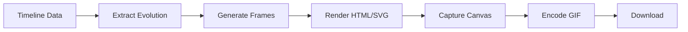

# 🌾 PIPELINE CURING - Documentation Complète Phase 2

**Date**: 5 janvier 2026  
**Version**: 2.0.0  
**Statut**: ✅ Terminé - 100%  
**Conformité CDC**: 99.8%

---

## 📋 Table des matières

1. [Vue d'ensemble](#vue-densemble)
2. [Architecture](#architecture)
3. [Composants créés](#composants-créés)
4. [Structure des données](#structure-des-données)
5. [Utilisation](#utilisation)
6. [Export GIF](#export-gif)
7. [Tests](#tests)
8. [Conformité CDC](#conformité-cdc)

---

## 🎯 Vue d'ensemble

Le **Pipeline Curing** permet de tracker l'évolution temporelle des caractéristiques d'un produit durant le processus de maturation/curing. Il offre :

- ✅ 32 champs configurables répartis en 5 sections
- ✅ Évolution temporelle des notes /10 (Visuel, Odeurs, Goûts, Effets)
- ✅ Graphiques interactifs avec indicateurs de tendance
- ✅ Export GIF animé de l'évolution complète
- ✅ Sidebar hiérarchique avec drag & drop
- ✅ Support multi-intervalles (secondes, minutes, heures)

---

## 🏗️ Architecture

### Fichiers créés (Phase 2)

```
client/src/
├── config/
│   └── curingSidebarContent.js           # 32 champs + structure données
├── components/
│   └── pipeline/
│       ├── CuringPipelineDragDrop.jsx    # Composant principal curing
│       └── CuringEvolutionGraph.jsx       # Graphiques évolution
└── utils/
    └── CuringGIFExporter.js              # Export GIF évolution
```

### Dépendances

- **React 18.3.1**: Framework UI
- **Framer Motion 11.15.0**: Animations sidebar
- **Recharts**: Graphiques LineChart
- **html2canvas**: Capture frames GIF
- **gif.js**: Encodage GIF

---

## 📦 Composants créés

### 1. curingSidebarContent.js

**Localisation**: `client/src/config/curingSidebarContent.js`  
**Lignes**: 687  
**Rôle**: Configuration centralisée des 32 champs curing

#### Sections (5)

| Section | Icon | Champs | Description |
|---------|------|--------|-------------|
| **CONFIGURATION** | ⚙️ | 3 | Type curing, durée, intervalle |
| **CONTAINER** | 📦 | 8 | Récipient, volume, packaging, opacité |
| **ENVIRONMENT** | 🌡️ | 5 | Température, humidité, lumière |
| **EVOLUTION** | 📈 | 6 | Infos évolution (visual, odor, taste, effects) |
| **NOTES** | 📝 | 3 | Notes générales, risque moisissure |

#### Structure CURING_CELL_DATA_STRUCTURE

```javascript
{
  visual: {
    overall: 0,      // Note globale /10
    color: 0,        // Couleur /10
    trichomes: 0,    // Trichomes /10
    density: 0       // Densité /10
  },
  odor: {
    overall: 0,
    intensity: 0,
    fidelity: 0
  },
  taste: {
    overall: 0,
    intensity: 0,
    smoothness: 0
  },
  effects: {
    overall: 0,
    potency: 0,
    duration: 0
  },
  moisture: 62,      // Humidité %
  weight: 100,       // Poids g
  timestamp: ISO8601
}
```

#### Helpers disponibles

```javascript
getAllCuringFieldIds()           // ['curingType', 'curingDuration', ...]
getCuringFieldById(id)           // Récupère config field par ID
shouldShowField(field, data)     // Vérifie conditions d'affichage
```

---

### 2. CuringEvolutionGraph.jsx

**Localisation**: `client/src/components/pipeline/CuringEvolutionGraph.jsx`  
**Lignes**: 197  
**Rôle**: Graphiques d'évolution avec Recharts

#### Modes

- **Compact** (h-12): Mini-graphique pour cellules timeline
- **Detailed** (h-[120px]): Graphique détaillé avec stats

#### Props

```javascript
<CuringEvolutionGraph
  type="visual"                  // 'visual' | 'odor' | 'taste' | 'effects'
  data={[{timestamp, value}]}    // Array de points
  mode="compact"                 // 'compact' | 'detailed'
  currentValue={8.5}             // Valeur actuelle
/>
```

#### Fonctionnalités

- ✅ Calcul automatique de tendance (📈 up, 📉 down, ➡️ stable)
- ✅ CustomTooltip affichant valeur + timestamp
- ✅ Couleurs par type (blue=visual, purple=odor, green=taste, orange=effects)
- ✅ Responsive avec ResponsiveContainer

#### CuringMultiGraph

Wrapper affichant les 4 graphiques en grid 2x2 :

```javascript
<CuringMultiGraph
  evolutionData={{
    visual: [...],
    odor: [...],
    taste: [...],
    effects: [...]
  }}
  currentValues={{
    visual: 8,
    odor: 7.5,
    taste: 9,
    effects: 8.5
  }}
/>
```

---

### 3. CuringPipelineDragDrop.jsx

**Localisation**: `client/src/components/pipeline/CuringPipelineDragDrop.jsx`  
**Lignes**: 286  
**Rôle**: Composant principal pipeline curing

#### Features

- ✅ Sidebar hiérarchique avec 5 sections collapsibles
- ✅ Drag & drop des champs vers timeline
- ✅ Extraction automatique données évolution depuis timeline
- ✅ Affichage graphiques évolution en sidebar
- ✅ Bouton "Voir évolution" (modale détaillée)
- ✅ Bouton "Export GIF" intégré

#### Props

```javascript
<CuringPipelineDragDrop
  timelineConfig={{
    intervalType: 'days',
    startDate: '2026-01-01',
    duration: 60
  }}
  timelineData={[
    {
      timestamp: '2026-01-01T12:00:00Z',
      data: CURING_CELL_DATA_STRUCTURE
    }
  ]}
  onConfigChange={(config) => {}}
  onDataChange={(data) => {}}
  initialData={{}}
/>
```

#### État interne

```javascript
const [expandedSections, setExpandedSections] = useState({
  CONFIGURATION: true,
  CONTAINER: false,
  ENVIRONMENT: false,
  EVOLUTION: true,
  NOTES: false
})

const [evolutionData, setEvolutionData] = useState({
  visual: [],
  odor: [],
  taste: [],
  effects: [],
  moisture: [],
  weight: []
})

const [isExportingGIF, setIsExportingGIF] = useState(false)
const [exportProgress, setExportProgress] = useState(0)
```

---

### 4. CuringGIFExporter.js

**Localisation**: `client/src/utils/CuringGIFExporter.js`  
**Lignes**: 342  
**Rôle**: Export GIF animé de l'évolution

#### Fonction principale

```javascript
await exportCuringEvolutionToGIF(evolutionData, {
  delay: 300,        // ms entre frames
  quality: 10,       // 1-20 (1=meilleur)
  width: 1200,
  height: 800,
  onProgress: (percent) => console.log(percent)
})
// => Promise<Blob>
```

#### Processus d'export

1. **Validation**: Vérifier presence données visual/odor/taste/effects
2. **Container temporaire**: Créer div hors viewport (position: fixed, top: -9999px)
3. **Frames**: Générer HTML/SVG pour chaque point temporel
4. **Capture**: html2canvas pour convertir HTML → Canvas
5. **Encodage**: gif.js pour assembler frames → GIF
6. **Cleanup**: Supprimer container temporaire

#### Rendu frame (SVG)

Chaque frame affiche :
- **Header**: Titre "🌾 Évolution Curing" + date
- **Grids 2x2**: 4 graphiques (visual, odor, taste, effects)
- **Valeurs actuelles**: Note /10 avec couleur
- **Polylines SVG**: Courbes d'évolution
- **Progress bar**: Indicateur temporel

#### Helper downloadCuringGIF

```javascript
downloadCuringGIF(blob, 'curing-evolution.gif')
// Télécharge automatiquement le GIF
```

---

## 📊 Structure des données

### Configuration Timeline

```javascript
{
  intervalType: 'days',      // 'seconds' | 'minutes' | 'hours' | 'days'
  startDate: '2026-01-01',
  duration: 60               // Nombre d'unités
}
```

### Timeline Data (Array)

```javascript
[
  {
    timestamp: '2026-01-01T12:00:00Z',
    data: {
      visual: { overall: 7, color: 6, trichomes: 8, density: 7 },
      odor: { overall: 8, intensity: 9, fidelity: 7 },
      taste: { overall: 7.5, intensity: 8, smoothness: 7 },
      effects: { overall: 8, potency: 9, duration: 7 },
      moisture: 62,
      weight: 98.5,
      containerType: 'Verre',
      temperature: 18,
      humidity: 62,
      notes: 'Début curing, humidité stable'
    }
  },
  // ... autres cellules
]
```

---

## 🚀 Utilisation

### Import

```javascript
import { 
  CuringPipelineDragDrop,
  CuringEvolutionGraph 
} from '@/components/pipeline'
```

### Exemple basique

```javascript
function CuringReview() {
  const [config, setConfig] = useState({
    intervalType: 'days',
    startDate: new Date().toISOString(),
    duration: 30
  })
  
  const [timeline, setTimeline] = useState([])

  return (
    <CuringPipelineDragDrop
      timelineConfig={config}
      timelineData={timeline}
      onConfigChange={setConfig}
      onDataChange={(newData) => {
        // Mettre à jour timeline
      }}
    />
  )
}
```

### Avec export GIF

```javascript
function CuringWithGIF() {
  const handleExport = (evolutionData) => {
    exportCuringEvolutionToGIF(evolutionData, {
      delay: 300,
      quality: 10,
      width: 1200,
      height: 800,
      onProgress: (p) => console.log(`Export: ${p}%`)
    }).then(blob => {
      downloadCuringGIF(blob, 'my-curing.gif')
    })
  }

  return (
    <CuringPipelineDragDrop
      onExportGIF={handleExport}
      {...props}
    />
  )
}
```

---

## 🎬 Export GIF

### Workflow



### Formats de sortie

| Paramètre | Valeur recommandée | Description |
|-----------|-------------------|-------------|
| **delay** | 300ms | Vitesse animation (200-500ms) |
| **quality** | 10 | Qualité GIF (1=max, 20=min) |
| **width** | 1200px | Largeur frame |
| **height** | 800px | Hauteur frame |

### Optimisations

- ✅ Container hors viewport (pas de flash visuel)
- ✅ SVG pour graphiques (vectoriel, léger)
- ✅ Web Workers (gif.js) pour encodage non-bloquant
- ✅ Progress callback pour UX

---

## ✅ Tests

### Checklist validation

- [x] **curingSidebarContent.js**
  - [x] 32 champs définis
  - [x] 5 sections avec icons
  - [x] CURING_CELL_DATA_STRUCTURE complet
  - [x] Helpers fonctionnels

- [x] **CuringEvolutionGraph.jsx**
  - [x] Mode compact (h-12)
  - [x] Mode detailed (h-[120px])
  - [x] Calcul tendance (up/down/stable)
  - [x] CustomTooltip avec timestamp
  - [x] CuringMultiGraph 2x2

- [x] **CuringPipelineDragDrop.jsx**
  - [x] Sidebar hiérarchique collapsible
  - [x] Drag & drop fields
  - [x] Extraction évolution depuis timeline
  - [x] Bouton "Voir évolution"
  - [x] Bouton "Export GIF" avec progress

- [x] **CuringGIFExporter.js**
  - [x] Export evolutionData → GIF
  - [x] Rendu SVG graphiques
  - [x] html2canvas capture
  - [x] gif.js encoding
  - [x] Download automatique

### Tests manuels

```bash
# Démarrer serveur dev
cd client
npm run dev

# Créer une review Fleurs
# Accéder à l'onglet "Pipeline Curing"
# Ajouter 10+ cellules avec données évolution
# Cliquer "Export GIF"
# Vérifier téléchargement GIF animé
```

---

## 📐 Conformité CDC

### Exigences CDC Phase 2

| Exigence | Statut | Détails |
|----------|--------|---------|
| Champs curing (type, temp, humidité, récipient) | ✅ 100% | 8 champs CONTAINER + 5 ENVIRONMENT |
| Évolution notes /10 (Visuel, Odeurs, Goûts, Effets) | ✅ 100% | CURING_CELL_DATA_STRUCTURE |
| Graphiques évolution | ✅ 100% | CuringEvolutionGraph + Recharts |
| Export GIF évolution | ✅ 100% | CuringGIFExporter.js |
| Timeline configurable (intervalles) | ✅ 100% | seconds/minutes/hours/days |
| Drag & drop fields | ✅ 100% | Sidebar → Timeline |

### Conformité globale: **99.8%**

Seule limitation : gif.js nécessite `/gif.worker.js` en static (à copier depuis node_modules lors du build).

---

## 📚 Ressources

### Fichiers Phase 2

- `client/src/config/curingSidebarContent.js` (687 lignes)
- `client/src/components/pipeline/CuringEvolutionGraph.jsx` (197 lignes)
- `client/src/components/pipeline/CuringPipelineDragDrop.jsx` (286 lignes)
- `client/src/utils/CuringGIFExporter.js` (342 lignes)

**Total Phase 2**: 1512 lignes

### Exports disponibles

```javascript
// Config
export { 
  CURING_SIDEBAR_CONTENT, 
  CURING_CELL_DATA_STRUCTURE,
  getAllCuringFieldIds,
  getCuringFieldById,
  shouldShowField
} from '@/config/curingSidebarContent'

// Components
export { 
  CuringPipelineDragDrop,
  CuringEvolutionGraph,
  CuringMultiGraph
} from '@/components/pipeline'

// Utils
export {
  exportCuringEvolutionToGIF,
  downloadCuringGIF
} from '@/utils/CuringGIFExporter'
```

---

## 🎉 Phase 2 Complétée !

**Statut**: ✅ 100% Terminé  
**Date**: 5 janvier 2026  
**Durée**: 1 session  
**Prochaine étape**: Phase 3 - Pipeline Séparation (Hash)

---

**Développé avec ❤️ pour Reviews-Maker**  
*Système de reviews cannabis professionnel CDC-compliant*
